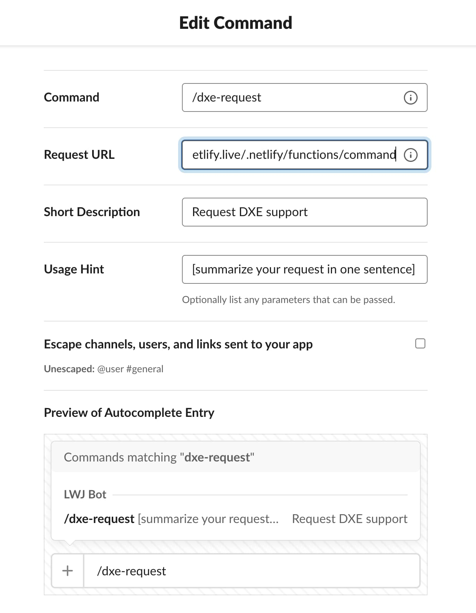
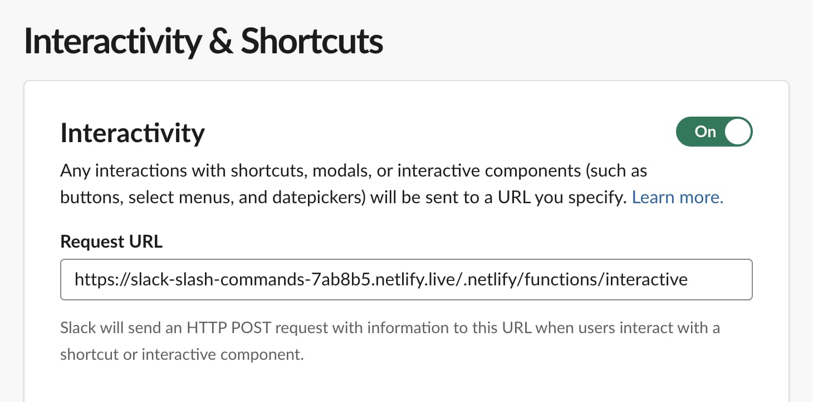

# Slack to Notion DB Slash Command

A slash command for Slack that will open a modal to collect request information, then save it to a Notion database.

This also sets up a [scheduled function](https://docs.netlify.com/netlify-labs/experimental-features/scheduled-functions/) to check for requests that still need to be triaged and post them to a Slack channel.

## Local Dev

### Env Vars

- `SLACK_BOT_OAUTH_TOKEN` — get one here: https://api.slack.com/apps
  - Required scopes: `channels:join`, `chat:write`, `commands`, 
- `NOTION_INTEGRATION_TOKEN` — get one here: https://www.notion.so/my-integrations
- `NOTION_DB_ID` — get the link to your database and the ID is the first hash after the domain and workspace name
    
    ```text
    https://www.notion.so/jlengstorf/29f4a66d910f43a9b70b4c7eda097187?v=953c4a04ea794fe9b931383b487c327c
                                     ^^^^^^^^^^^^^^^^^^^^^^^^^^^^^^^^
                                             this is the DB ID
    ```
- `SLACK_CHANNEL_ID` — right click on the channel you want to notify in Slack, then copy => copy link and grab the channel ID from the end of the URL

    ```text
    https://learnwithjason.slack.com/archives/C043M67FJUR
                                              ^^^^^^^^^^^
                                              channel ID
    ```

### Initial Setup

-   Fork and initialize the repo

    ```sh
    # use the GitHub CLI because it rules
    gh repo fork learnwithjason/slack-bot

    # initialize a new Netlify site
    ntl init
    ```

-   Set up the required env vars

    ```sh
    ntl env:set SLACK_BOT_OAUTH_TOKEN <your_token>
    ntl env:set NOTION_INTEGRATION_TOKEN <your_token>
    ntl env:set NOTION_DB_ID <your_db_id>
    ntl env:set SLACK_CHANNEL_ID <your_channel_id>
    ```

-   Start the server with a live tunnel

    ```sh
    ntl dev --live
    ```

-   Create a new Slack slash command and set the Request URL to your live dev URL

    ```text
    https://<site_name>-<hash>.netlify.live/.netlify/functions/command
    ```

    

-   Turn on Slack Interactivity and set the Request URL to your live dev URL

    ```text
    https://<site_name>-<hash>.netlify.live/.netlify/functions/interactive
    ```

    

-   Add the bot to the channel by visiting `/.netlify/invite-to-slack`

-   Run the slash command to verify that things are working as expected


Once everything is verified working, deploy the site and update your Slack slash command and interactivity request URLs to use the production site.
